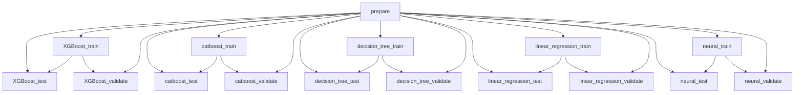

```mermaid
flowchart TD
	node1["XGBoost_test"]
	node2["XGBoost_train"]
	node3["XGBoost_validate"]
	node4["catboost_test"]
	node5["catboost_train"]
	node6["catboost_validate"]
	node7["decision_tree_test"]
	node8["decision_tree_train"]
	node9["decision_tree_validate"]
	node10["linear_regression_test"]
	node11["linear_regression_train"]
	node12["linear_regression_validate"]
	node13["neural_test"]
	node14["neural_train"]
	node15["neural_validate"]
	node16["prepare"]
	node2-->node1
	node2-->node3
	node5-->node4
	node5-->node6
	node8-->node7
	node8-->node9
	node11-->node10
	node11-->node12
	node14-->node13
	node14-->node15
	node16-->node1
	node16-->node2
	node16-->node3
	node16-->node4
	node16-->node5
	node16-->node6
	node16-->node7
	node16-->node8
	node16-->node9
	node16-->node10
	node16-->node11
	node16-->node12
	node16-->node13
	node16-->node14
	node16-->node15
```
